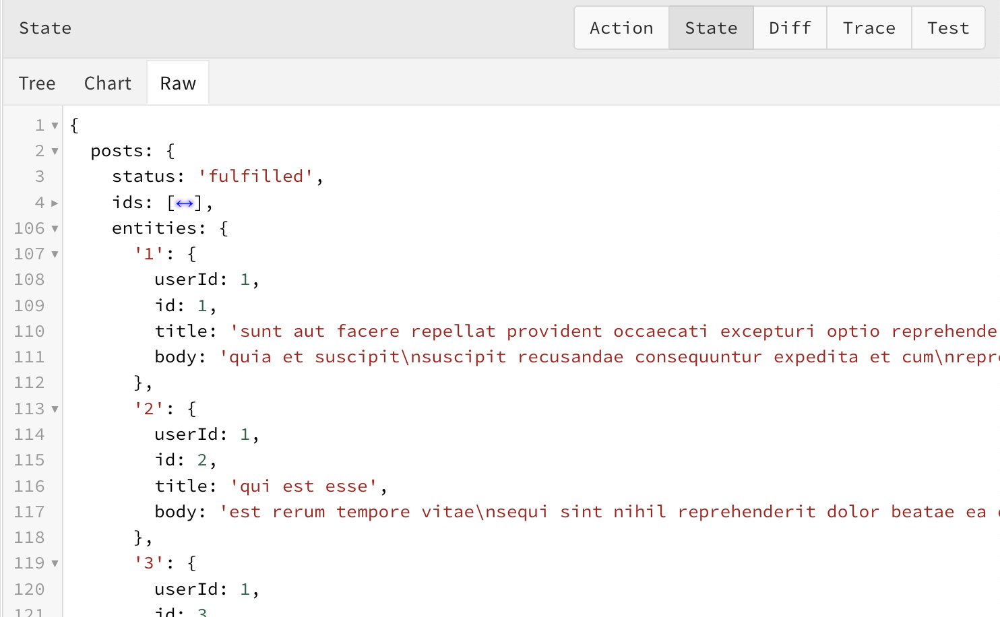

# Redux Toolkit : the step by step migration

---

## Whoami

- Maxime Blanc
- Tech lead at **@Bedrock_Stream**
- Building **@\_progressively**
- **@jean-smaug**
- https://maximeblanc.fr

---

## What is Redux ?

- A JS library
- Global state manager
- Created by **Dan Abramov** and **Andrew Clark**.
- Maintained by **Mark Erikson** and **Tim Dorr**.
- Inspired by **Flux**, **Elm**, **Immutable**...

Source : Wikipedia

---

## Redux's concepts

- State
- Action
- Action Creator
- Dispatcher
- Reducer

---

## State



---

## Global view


---

## Action

An objet with a `type` key

```js
const myAction = {
  type: "users/FETCH_SUCCESS",
};
```

---

## Conventions for actions

`payload` key for extra data

```js
const myActionWithPayload = {
  type: "users/FETCH_SUCCESS",
  payload: [{ name: "Jeansmaug", age: 27 }],
};
```

`error` key for... 🥁 errors

```js
const myActionWithError = {
  type: "users/FETCH_SUCCESS",
  error: { name: "Error", message: "Couldn't reach the API" },
};
```

---

## Action creator

A function that returns an action

```js
const actionCreator = () => {
  return {
    type: "users/FETCH_SUCCESS",
  };
};

const actionCreatorWithParam = (users) => {
  return {
    type: "users/FETCH_SUCCESS",
    payload: users,
  };
};
```

---

## Dispatcher

A method which is **the only way** to update the store.

```js
import { createStore } from "redux";

const store = createStore();

store.dispatch({
  type: "users/FETCH_SUCCESS",
});
store.dispatch(actionCreator());
```

---

## Reducer

A pure function that listens for actions and produces a new state

```js
const initialState = {
  users: [],
};

const reducer = (state = initialState, action) => {
  switch (action.type) {
    case "users/FETCH_SUCCESS":
      return { ...state, users: action.payload };

    default:
      return state;
  }
};
```

---

## Synthesis


---

## Redux Toolkit (RTK)

RTK = Redux + Steroid (don't do drugs 🙏)

---

## It's demo time!

---

## Personnal feedback on RTK

1. **Simplifies usage**.
1. It's **not a magical tool** that can solve everything.
1. Introduces an additional layer of abstraction.
1. Aids in structuring store architecture.
1. Promotes good practices.

---

## Any questions ?

(if we have time 😇)
