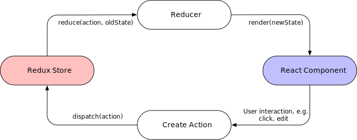

# Migration progressive vers Redux Toolkit

---

## Redux, c'est quoi ?

---

## Une librairie JS

- Créée par **Dan Abramov** et **Andrew Clark**.
- Maintenue par **Mark Erikson** et **Tim Dorr**.
- Gestionnaire d'état global
- Inspirée par **Flux**, **Elm**, **Immutable**...

---

## Métaphore


---

## Création du système

- Pour que le centre existe, il faut le bâtir
- Pour pouvoir utiliser Redux, il faut créer un store

```js
import { createStore } from "redux";

const store = createStore(...);
```

---

## Quelle entité transite ?

- Pour pouvoir transiter, **un colis** doit avoir **une adresse**
- Pour pouvoir transiter, **une action** doit avoir **un type**

```js
const action = {
  type: "posts/FETCH_POSTS_SUCCEED",
};
```

---

## Un action creator

```js
const actionCreator = () => {
  return {
    type: "posts/FETCH_POSTS_SUCCEED",
  };
};
```

---

## Le transit est-il autorisé par le système ?

- Pour pouvoir transiter, un colis doit être **affranchi**
- Pour pouvoir transiter, une action doit **être dispatché**

```js
const actionCreator = () => {
  return {
    type: "posts/FETCH_POSTS_SUCCEED",
  };
};

store.dispatch(actionCreator());
```

---

## Comment est traitée une entité

- Un tapis redirige le colis en fonction de son adresse
  

  <br>

- **Un reducer** modifie l'état de l'application en fonction d'une action

---

## Un reducer

```js
const initalState = {
  posts: [],
};

const reducer = (state = initalState, action) => {
  switch (action.type) {
    case "posts/FETCH_POSTS_SUCCEED": {
      return { ...state, posts: action.payload };
    }

    default: {
      return state;
    }
  }
};
```

---

## Synthèse



---

## Redux Toolkit (RTK)

RTK = Redux + Stéroïdes

---

## C'est l'heure de la démo

---

## Des questions ?

(si je n'ai pas dépassé le temps imparti)
